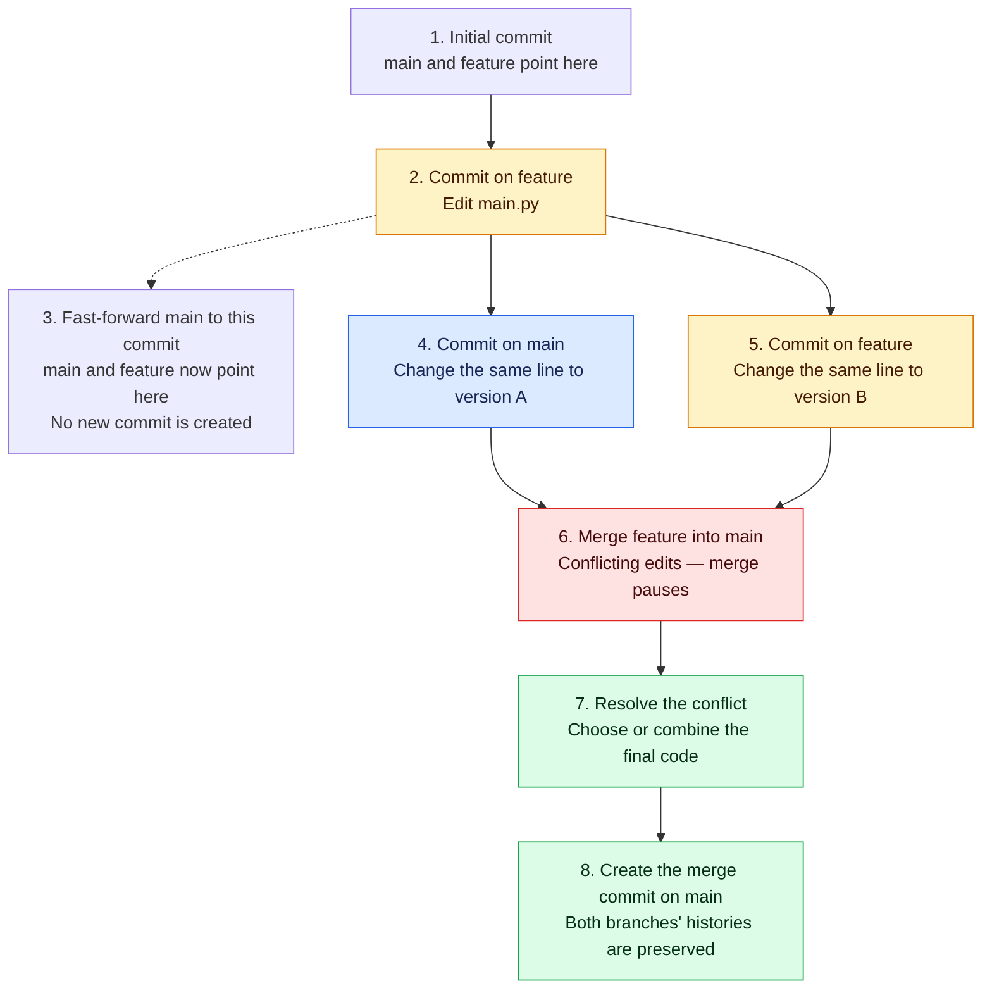
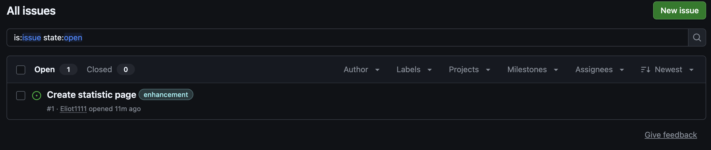
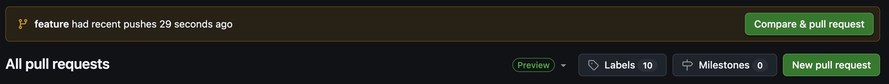
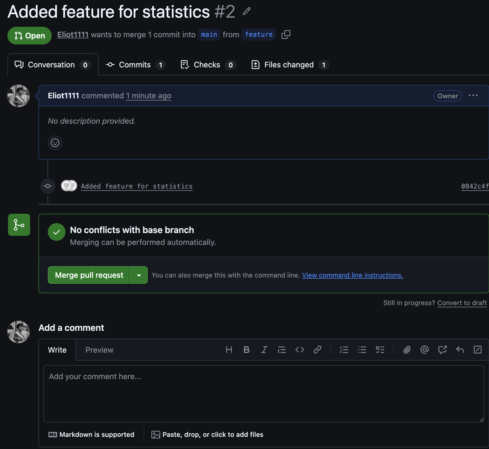

# Git Workflow Simulator

```
Documented a Git workflow project covering branching strategy, pull requests, conflict resolution, tags, releases and changelog
automation.
```
## Solving git merge conflict

**Explanation**:
In the project I have 3 brances:
- main
- dev
- feature  
I have eddited main.py in the main branch, than I have commited it. To create the conflict I also made some correction in the same file in branch feature. Because I had 2 versions of the file in the same place, the conflict appeared. To solve this conflict, I left only one version of the code in main.py. Than, I made merging again and finished with the final commit (da07bb6).

### Branch history and merge conflict resolution




## Creating issue template, adding new features and creating PR

I decided to make a feature, that you can see how often users are visiting different pages. I made a suggestion in GitHub on tab "Issues":



Than I create a file *login_statistics.py*. Added to index -> commited -> Pushed on branch feature.

Afterwards I created PR (I willn't delete it to show you)


Than I accepted this PR and as you can see there are no any conflicts for merging:



## Conventional comments and changelog

Now I have used *conventional commit*, I did it to add CHANGELOG.md, where I described what is going to be released and which features are already in the project. Then I commited this file to feaute branch and created PR (You can see it as **Added feature for statistics #2**)

How I created conventional comment:
```bash
git commit -m "docs{changelog} Added changelog before the release"
```

## Release
I have created a release, so you can download the code base and run it on your computer!